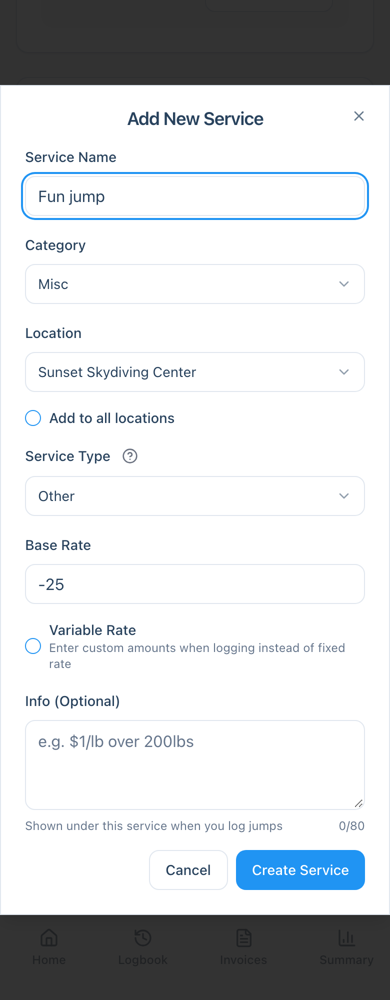
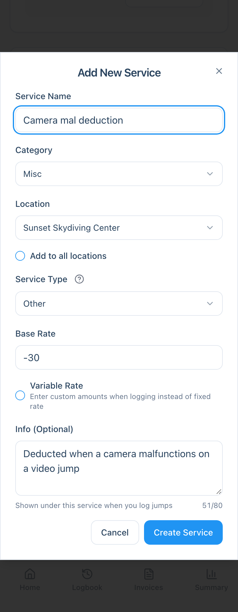
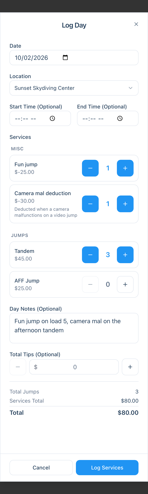
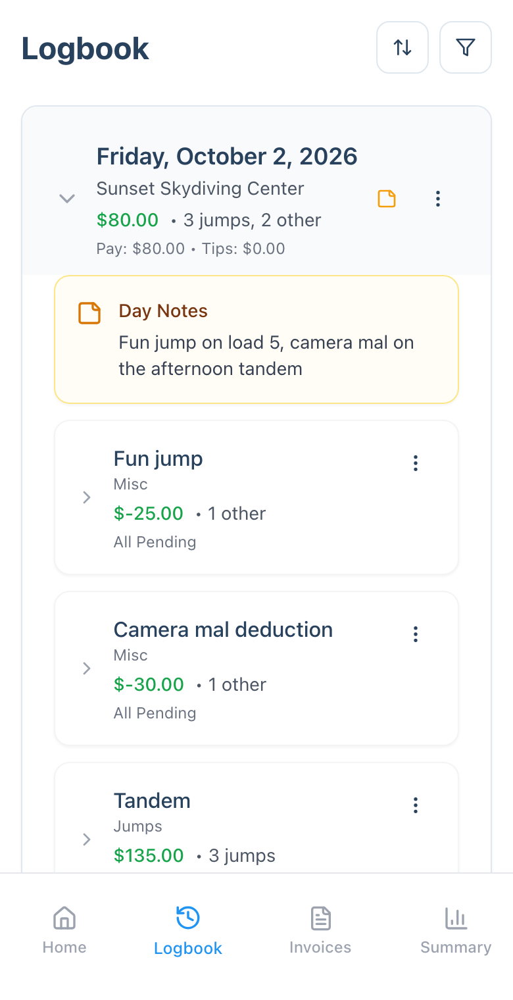
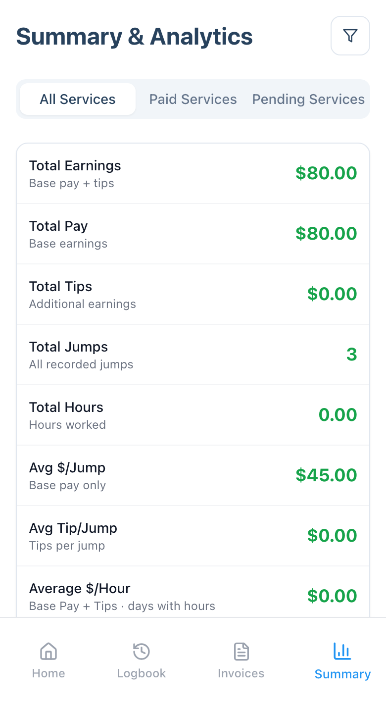

Does your dropzone take fun jumps, camera malfunction deductions or other charges out of your pay? This case study shows how to record them as negative amounts so your earnings reflect what you actually take home, without distorting your jump statistics.

**The scenario:** a tandem instructor whose dropzone deducts $25 for each fun jump and $30 whenever a camera malfunctions on a video jump. They want those amounts on the same day as the work they came out of.

## The idea

A deduction is just a service with a **negative rate**. You set it up once, then log it like any other service. Two settings make it work:

- **A negative Base Rate** (for example `-25`) subtracts the amount from your day's total.
- **Service Type: Other** keeps it out of your jump count. Only services of type **Jump** count as jumps, and your **Avg $/Jump** only looks at jump pay. If you set a deduction up as a Jump, it would count as a jump and drag that average down. For the full rules, see [How Jump Counts and Totals Are Calculated](/technical/how-totals-are-calculated/).

## Step 1: Add a Fun jump service

You only do this once per location.

1. Open **Settings**, then go to **Services & Categories**. If you don't have a place for non-jump services yet, tap **Category** (it shows as **Cat** on small screens) and create one called `Misc`.
2. Tap **Service** to open **Add New Service**.
3. Set **Service Name** to `Fun jump`.
4. Set **Category** to `Misc`, and pick your **Location** (or turn on **Add to all locations**).
5. Set **Service Type** to `Other`.
6. Set **Base Rate** to the amount your dropzone deducts, as a negative number, such as `-25`.
7. Leave **Variable Rate** off, then tap **Create Service**.

:::note
**Variable Rate** only accepts positive amounts, so it can't be used for deductions. Give each deduction its own service with a fixed negative rate instead.
:::

## Step 2: Add other deductions the same way

Repeat the steps for anything else that gets deducted. Here it's a **Camera mal deduction** at `-30`.

The **Info** field is a good place to remember the rule. Whatever you type there shows under the service whenever you log it.

## Step 3: Log them with your day

Log deductions the same way as anything else, with **Log Day** at the end of the day or **Log Single** as they happen. Your deductions appear in their own **Misc** group. Use **+** to set how many apply. If you took two fun jumps, set Fun jump to `2`.

Deductions show with the minus sign after the dollar sign, such as `$-25.00`. The running total at the bottom already includes them.

In this example, three tandems at $45 minus a $25 fun jump and a $30 camera mal deduction comes to $80.

Day Notes are a handy place to say which load or which jump a deduction belongs to.

## Step 4: Check your Logbook

In your **Logbook**, the day shows the net total and counts the deductions as **other**, not as jumps: `3 jumps, 2 other`. Expand the day to see each deduction as its own service with a negative amount.

## What it does to your numbers

On the **Summary** page, filtered to this one day:

- **Total Earnings** is $80. The deductions reduce it, because that's what you took home.
- **Total Jumps** is 3, and **Avg $/Jump** is $45. Neither is affected, since the deductions are type **Other**.
- If you log start and end times, your **Average $/Hour** also reflects the deductions, because it's based on your total earnings for the day.

## Tips

- Keep deductions in their own category, like `Misc`, so they stay grouped together and away from your paid services.
- Name each deduction after the rule that causes it. It makes your Logbook easy to read when you look back.
- If a deduction amount differs from time to time, add a separate service for each amount, such as `Camera mal deduction (half)`.
