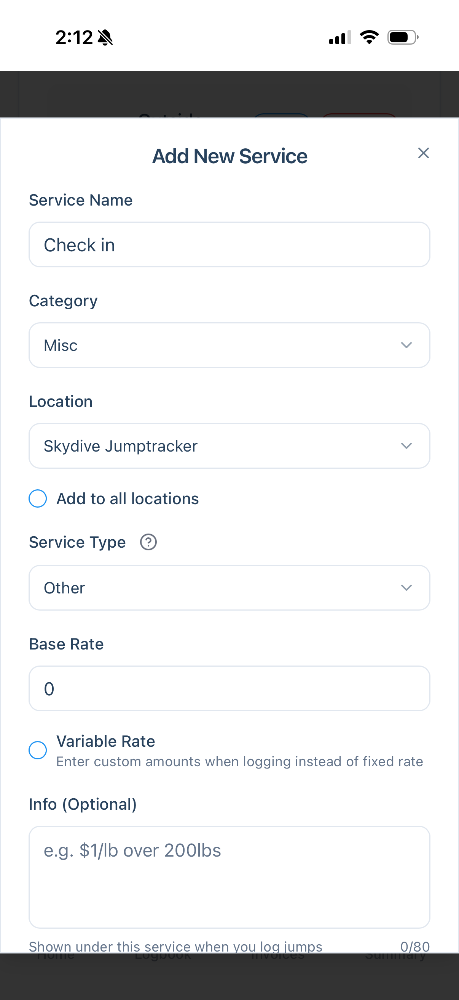
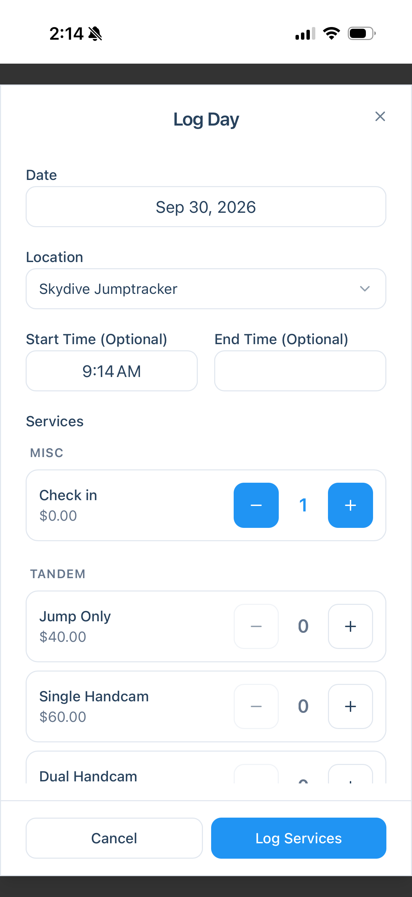
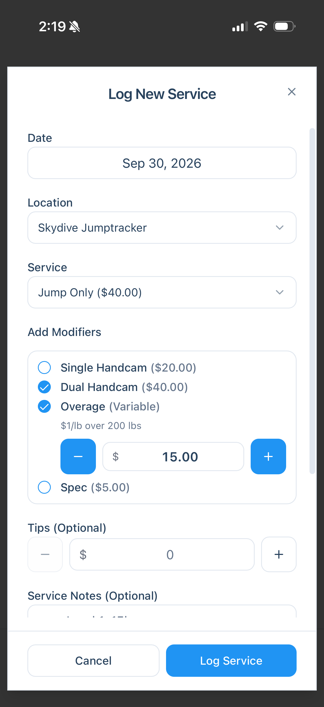
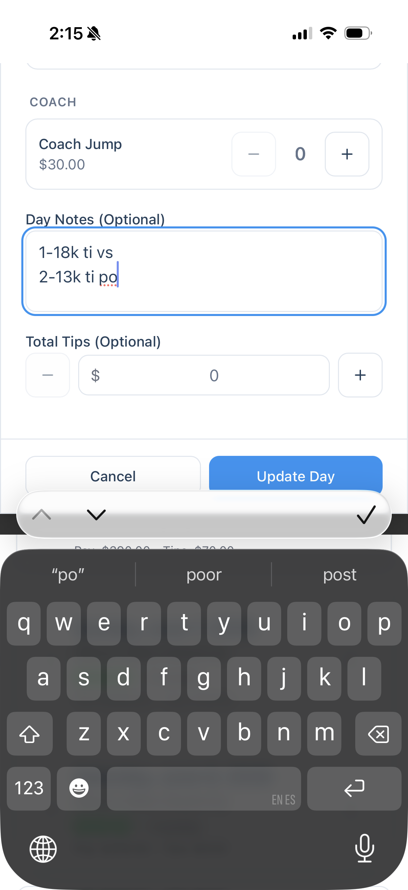
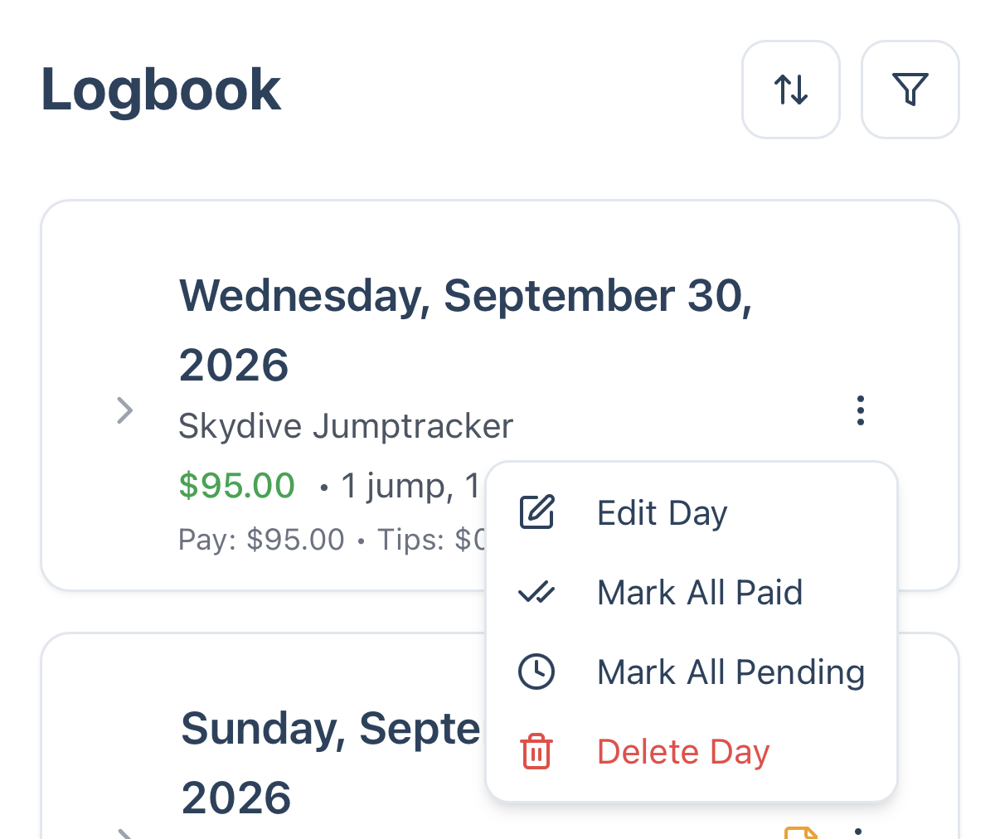
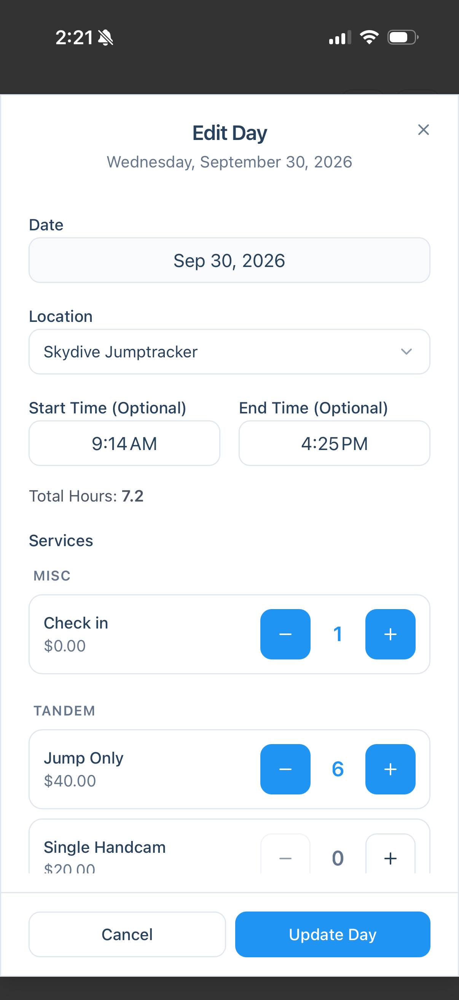

Want JumpTracker Pro to track hourly earnings, not just jump metrics? This case study shows a simple routine: start the day with a **Check in**, log jumps as they happen, and close out the day with your end time and final counts.

**The scenario:** a tandem instructor working a full day at the dropzone who wants accurate hours, per-jump details and a day total, without remembering everything at the end of the day.

## The idea

JumpTracker Pro can store a start and end time on any logged day and works out your total hours for you. Tracking hours also let's you calculate your average hourly pay rate, a useful metric to know. 

To clock your check in time when you arrive, you log a service with zero pay: a **Check in**. This locks the start time and everything else you log that day lands on the same day in your Logbook.

## Step 1: Add a Check in service

You only do this once per location.

1. Open **Add New Service**.
2. Set **Service Name** to `Check in`.
3. Set **Category** to `Misc`, and pick your **Location** (or turn on **Add to all locations**).
4. Set **Service Type** to `Other`.
5. Leave **Base Rate** at `0`.

Because the rate is $0, checking in never changes your earnings. It exists only to lock your start time.

## Step 2: Check in when you arrive

When you get to the dropzone, open **Log Day**, confirm the date and location, and set your **Start Time**. Leave **End Time** empty for now. You'll update it later.

## Step 3: Logging jumps

Pick whichever of these fits how you work. You can mix them during the same day.

### Scenario A: Log single jumps

After each jump, open **Log New Service** and choose the service. Add any **Modifiers** that applied (in this example a dual handcam and a variable overage amount), plus **Tips** and **Service Notes** if you like.

In this example I've got a **Variable** overage, and I've added a memo on that service's **Info** field to remember how the dropzone pays out for it.

### Scenario B: Bulk log at the end of the day

If you prefer to just log everything at the end of the day via the **Log Day** form, skip to step 4.

### Scenario C: Use Day Notes and import a Burble CSV afterwards

If you plan to [import your Burble logbook](/technical/import-burble-logbook/) afterward, jot short notes during the day. In the day's **Day Notes** field, write one line per jump (for example, load number, altitude, jump and video details) so you can reconcile them later.

## Step 4: Close out the day

At the end of the day, go back to your Logbook and edit the day.

1. Find today's entry and tap the **⋮** menu.
2. Choose **Edit Day**.

3. Enter your **End Time**. JumpTracker Pro fills in **Total Hours** for you.
4. Adjust the service counts to match what you actually did, then tap **Update Day**.

## What you end up with

- One Logbook entry for the day, with your start and end times and total hours.
- Your final jump counts and earnings, plus tips and notes.
- No extra pay from the Check in itself, since it's $0.
- A **Summary** page that tracks your average hourly earnings as well as other metrics.

## Tips

- Start the day with the Check in even if you log nothing else until evening. It's what records your start time so you don't have to remember it.
- Checking in and closing out the day when it actually occurs makes it easy to punch the right time. If you forget, you can still add them later from **Edit Day**.
