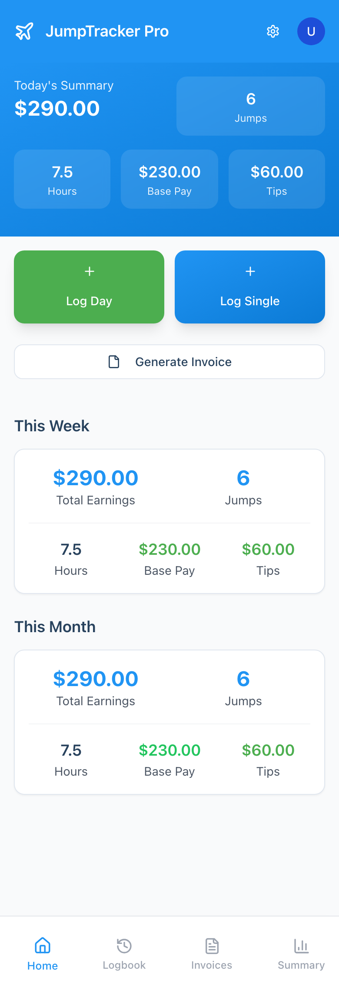
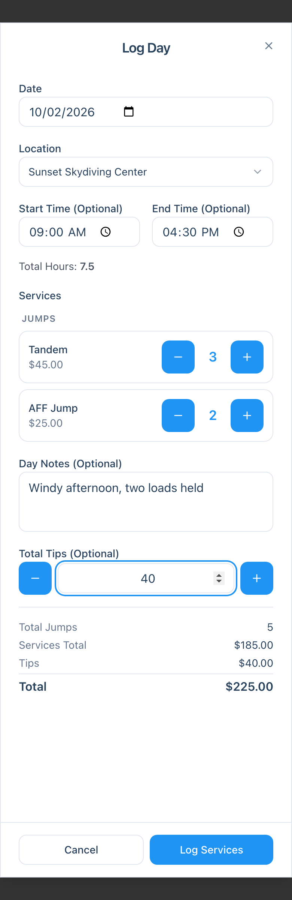
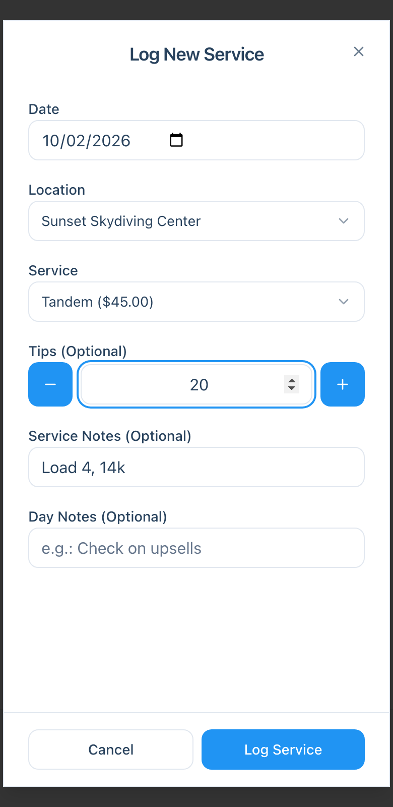
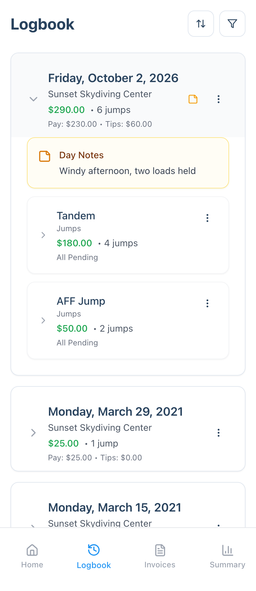
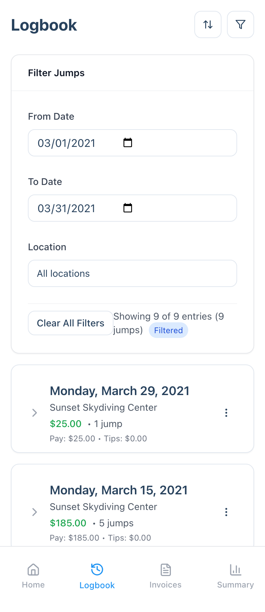

This guide covers the three screens you'll use every day: the **Dashboard**, the **Log Day** and **Log Single** forms, and the **Logbook**. It assumes you've already added a location and services in **Settings**.

## The Dashboard

The **Home** tab shows how you're doing at a glance.

- **Today's Summary** at the top shows today's earnings, jumps, hours, base pay and tips.
- **This Week** and **This Month** show the same numbers for the current week and month. You can choose which day your week starts on in **Settings**.
- **Log Day** and **Log Single** open the two logging forms, covered below.
- **Generate Invoice** builds an invoice for a date range and location.
- The bar along the bottom switches between **Home**, **Logbook**, **Invoices** and **Summary**.

Earnings are your base pay plus tips. If you have pack jobs turned on, a **Pack Jobs** count appears next to **Jumps**. For how each number is worked out, see [How Jump Counts and Totals Are Calculated](/technical/how-totals-are-calculated/).

## Log a whole day

Use **Log Day** when you want to enter a day's work in one go, usually at the end of the day.

1. Tap **Log Day** on the dashboard.
2. Confirm the **Date** and **Location**.
3. Optionally set a **Start Time** and **End Time**. **Total Hours** is worked out for you.
4. Use **+** and **−** to set how many of each service you did. Services are grouped by category.
5. Add **Day Notes** and **Total Tips** if you like. The tips buttons move in $5 steps, or you can type an exact amount.
6. Check the running totals at the bottom, then tap **Log Services**.

If you log here often, tap **Set as default** under the location to have it preselected next time.

If you already have a day logged for that date and location, the app tells you and offers to open the existing day for editing instead of creating a second one.

## Log a single service

Use **Log Single** to record one service right after you do it.

1. Tap **Log Single** on the dashboard.
2. Confirm the **Date** and **Location**, then pick the **Service**.
3. If the service has modifiers, such as a handcam, tick the ones that apply. Variable services ask for an **Amount**.
4. Add **Tips**, **Service Notes** (a short note on this one entry, such as the load number) or **Day Notes** if you like.
5. Tap **Log Service**.

Single entries land on the same day in your Logbook as anything else you log for that date and location, so you can mix both forms in one day.

**Which one should I use?** Log Single is quicker in the moment and lets you attach notes and modifiers to each service. Log Day is quicker when you're entering the whole day afterward.

## The Logbook

The **Logbook** tab lists every day you've logged, newest first. Each card shows the date, location, total earned, jump count, and the split between base pay and tips. A note icon means the day has Day Notes.

Tap a day to expand it. You'll see its notes and a card for each service with the count, the amount and its payment status. Tap a service to see the individual entries.

Each level has a **⋮** menu:

| Level | Options |
|---|---|
| **Day** | **Edit Day**, **Mark All Paid**, **Mark All Pending**, **Delete Day** |
| **Service** | **Mark All Paid**, **Mark All Pending** |
| **Single entry** | **Edit Note**, **Mark as Paid**, **Mark as Pending**, **Delete Jump** |

**Edit Day** is also where you add an end time or change counts after the fact. See [Log Your Day with a Check In](/case-studies/log-your-day-with-check-in/) for an example.

## Filter your Logbook

Tap the **filter** icon at the top right of the Logbook to narrow what you see.

- **From Date** and **To Date** limit the list to a date range. You can set just one of them.
- **Location** shows a single location, or **All locations**.

The panel shows how many entries match, and a **Filtered** badge appears while a filter is on. Tap **Clear All Filters** to reset. If nothing matches, the Logbook says so and offers a **Clear Filters** button.

Filters only change what the Logbook shows. They don't change your dashboard totals.

The icon with two arrows next to the filter lets you **Import CSV**, **Export CSV** and **View Import History**. Export has its own date range, separate from the filters. To bring in a Burble history, follow [Import Your Burble Logbook](/technical/import-burble-logbook/).

## Next steps

- Log your first day, then check that the dashboard and Logbook totals match what you expect.
- Want to track hours as well? Read [Log Your Day with a Check In](/case-studies/log-your-day-with-check-in/).
- Ready to get paid? Tap **Generate Invoice** on the dashboard.
