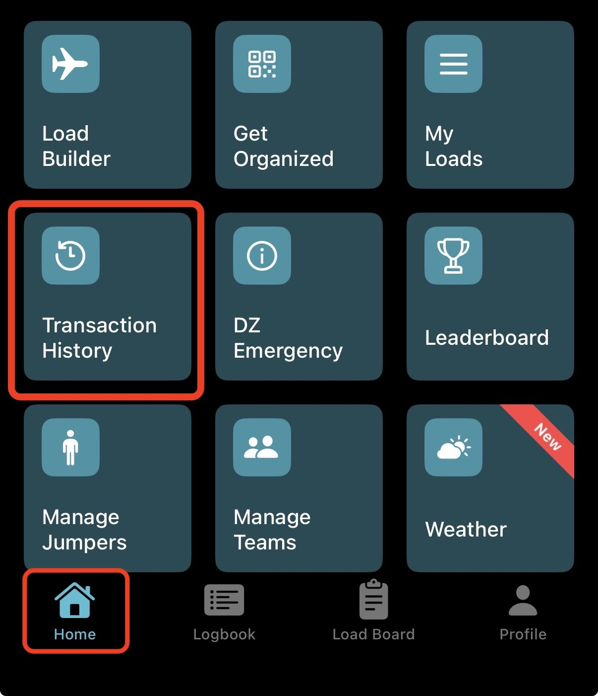
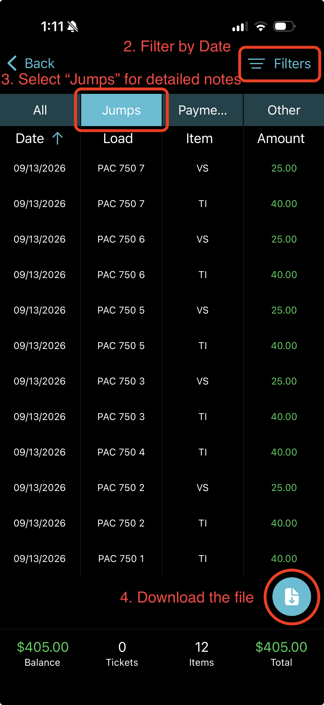
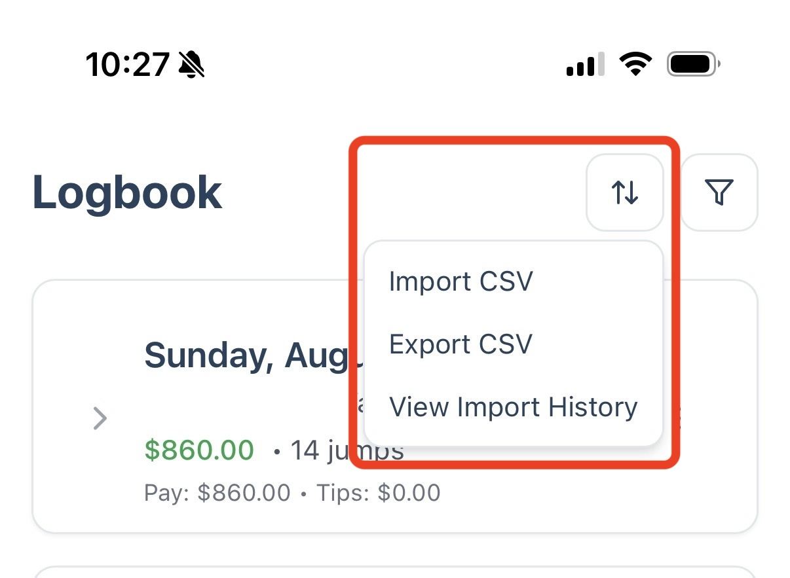

If your dropzone uses Burble to track jumps, you can export your history from Burble and bring it into JumpTracker Pro instead of typing it in again. It's also a quick way to set up a new dropzone. This guide walks through the import from start to finish.

## Before you start

- **Set up the location during the first import:** you can add the dropzone and set up everything during the import, and the wizard guides you. This will be the cleanest and easiest way to set it up, and future imports will map automatically.
- **If you already have a location set up:** starting from scratch may make future imports much qucker. You can set up a new dropzone with a different name when you set up with the first burble import. You can leave your existing location and clean it up once you're happy with the Burble import.
- **Keep your Burble item codes the same:** if you import again later, codes you have already mapped are matched automatically. Use your service's info field to clarify what they are.

## Get your file from Burble

You need Burble's **Transaction History** export. It is a CSV file with four columns: `Load`, `Date`, `Item` and `Amount`.

**1. Open Transaction History.** In the BurbleMe app on your phone, select your dropzone. From the **Home** screen, tap **Transaction History**.

**2. Filter by date.** Tap **Filters** and choose the date range you want to import.

**3. Choose a tab.** Select **Jumps** if you want detailed notes to come across. Otherwise select the **All** tab.

**4. Download the file.** Tap the download button at the bottom right.

## Start the import in JumpTracker Pro

1. Open the **Logbook** page.
2. Tap the import/export icon (the two arrows) at the top right and choose **Import CSV**.
3. Choose **Burble Transaction History** as the source.

Then follow the import wizard through the steps presented.

## Some Notes 

### Payment Status

Choosing the **payment status for this batch**: **Paid** or **Pending**, applies to every entry in the file. If some of your Burble entries were paid and others weren't, import them as two separate files, or change individual entries afterward.

### Amounts come straight from Burble

For imports where the dropzone is already set up, the **Amount** in your file is imported as-is. JumpTracker Pro does **not** recalculate it from the rate you have set for that service. If your configured rate differs from what Burble paid, the imported entry keeps Burble's number. 

If this is the first time setup import, the services created will be set from Burble's import file and future logging via the app will use those amounts.

## If something looks wrong: undo

Every import is saved as a batch. To remove one:

1. On the **Logbook** page, open the import/export menu and choose **View Import History**.
2. Find the batch and choose undo. You will be asked to confirm.

Undo removes exactly the entries that import created. Two things to know:

- It **cannot** be reversed once you confirm it.
- Any services or categories the import created for you stay in your settings. Delete them there if you don't want them.

## What to check afterward

- If this is a first time setup import, go to your **Settings** page and double check that your new services have a properly defined **service type** and are set as **variable** if necessary. You can also add a **memo** about the service for a plain text description beyond an ambiguos burble code.
